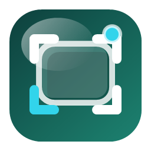
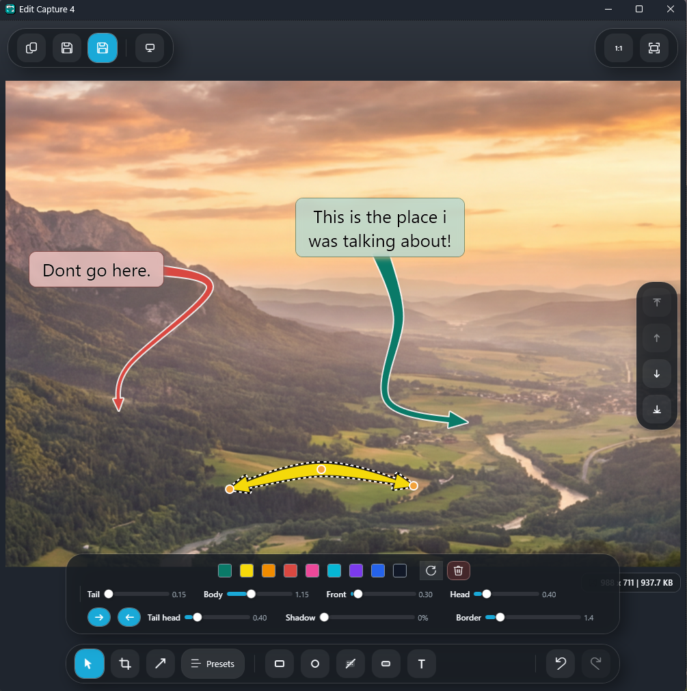
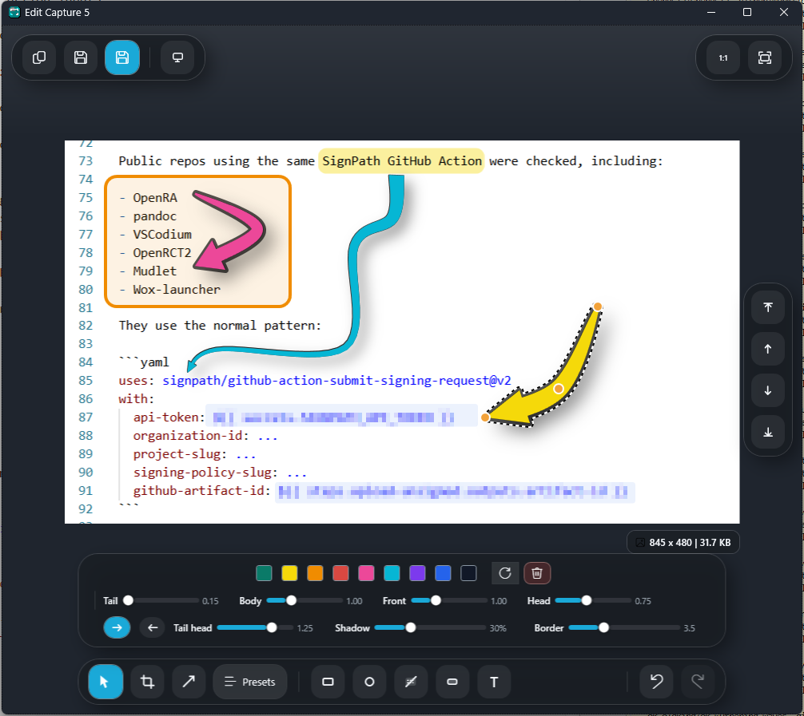

# Degrande ScreenShot

Degrande ScreenShot is a Windows screenshot tool built for fast region capture, clipboard-first workflows, and lightweight annotation without bouncing between multiple apps.

It opens as a compact popup-style launcher, stays accessible from the tray, and includes a built-in editor for arrows, callouts, text, crop, highlight, and redaction-style obscuring.

<p align="center">
  
</p>

## App Preview

<p align="center">
  
  
</p>

## What It Does

- Capture a screen region from a popup launcher or global hotkeys.
- Send the result straight to the clipboard, straight to the editor, or choose after capture.
- Open existing clipboard content directly in the editor.
- Annotate with arrows, frames, circles, highlights, text, and obscured areas.
- Adjust arrow tail, body, front, head, border, and shadow values visually.
- Apply text alignment and bold styling inside text annotations.
- Reorder layers, crop the canvas, and use undo/redo while editing.
- Start with Windows and live quietly in the tray when not in use.

## Shortcuts

The launcher registers these global shortcuts:

| Shortcut | Action |
| --- | --- |
| `Ctrl + Shift + Alt + 4` | Open the capture launcher |
| `Ctrl + Shift + Alt + 5` | Open the capture launcher |
| `Ctrl + Shift + Alt + 6` | Capture a region straight to the clipboard |
| `Ctrl + Shift + Alt + 7` | Capture a region straight to the editor |
| `Ctrl + Shift + Alt + 8` | Open the current clipboard contents in the editor |
| `Ctrl + Shift + Alt + 9` | Capture a scrolling region straight to the editor |

## Editor Tools

The editor currently includes:

- Select
- Crop
- Arrow
- Frame
- Circle
- Obscure sensitive content
- Area highlight
- Text
- Layer controls
- Undo and redo history

## Build And Run

### Requirements

- Windows 10 or Windows 11
- .NET 9 SDK

### Run locally

```powershell
dotnet restore .\DegrandeScreenShot.sln
dotnet build .\DegrandeScreenShot.sln -c Release
dotnet run --project .\src\DegrandeScreenShot.App\DegrandeScreenShot.App.csproj -c Release
```

### Run tests

```powershell
dotnet test .\DegrandeScreenShot.sln -c Release
```

## Releases

GitHub Actions builds self-contained Windows release artifacts for the app and installer. For current Windows trust and installation notes, see [docs/windows-trust-and-install.md](./docs/windows-trust-and-install.md).

## Repository Layout

- `src/DegrandeScreenShot.App` - WPF desktop application
- `src/DegrandeScreenShot.Core` - shared core project
- `tests/DegrandeScreenShot.Tests` - automated tests
- `installer` - Inno Setup installer script
- `docs` - supporting documentation
